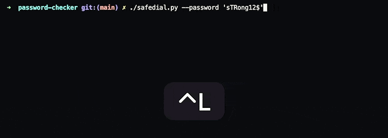

# Password Checker

  

## Usage
`./safedial.py --password <password to check>`
  

`config.yaml` is an optional file. Allows switch logging verbosity level.
`./safedial.py --help` check for accepted CLI flags to rune password requirements.

## Developing guides

1. Do `npx husky install` install githooks for this repo.  
`.husky/commit-msg` enforces commit messages to follow [conventionalcommits](https://www.conventionalcommits.org/en/v1.0.0/).  
2. Sign your commits with your gpg key.
3. Lint code

-------
## Corporate Identity LOL

*Generated with AI powered tool [ Namelix](https://namelix.com/)